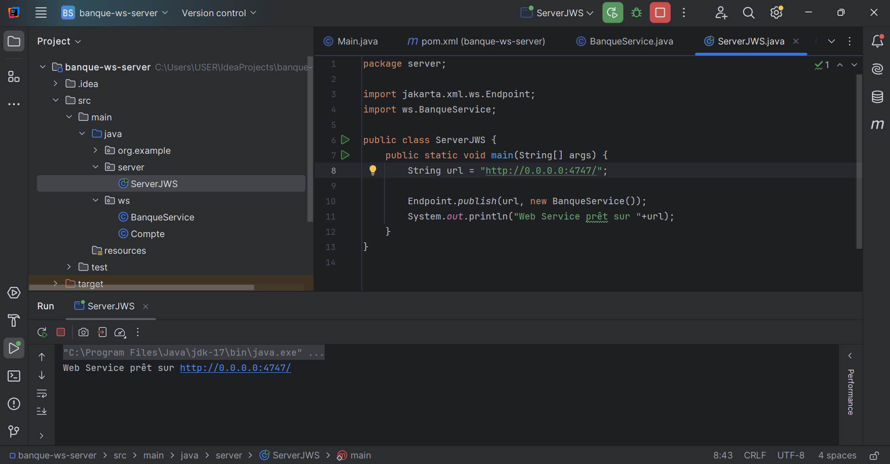

# Banque Web Service - SOAD WSDL

## 1 - Lancement de serveur

## 2 - Consultation de WSDL

## 3 - Test avec SOAPUI 

1. #### Test conversion EURO => MAD
   

2. #### Test get compte par code
   

3. #### Test get liste des comptes
   

## 4 - Test par application client

